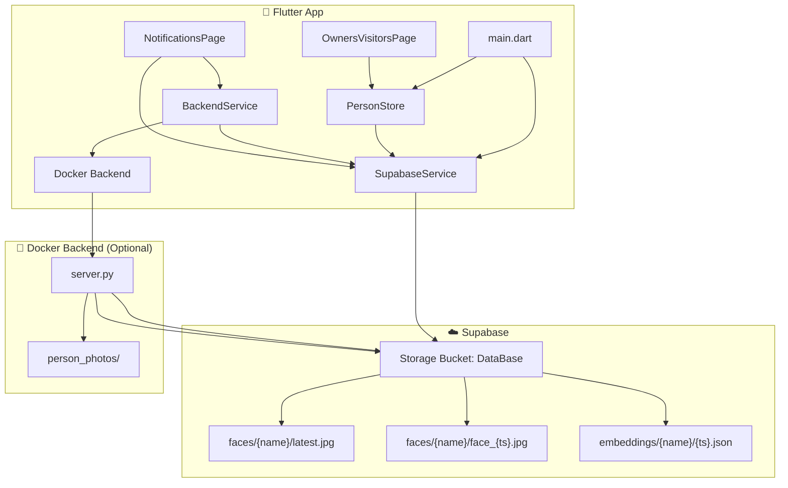

# Guardian App — Supabase Integration Complete ✅

## What Changed

### New Files Created
| File | Purpose |
|------|---------|
| [supabase_config.dart](file:///home/mahmoud/Desktop/The_Guardian_app/flutter_application_1/lib/core/supabase_config.dart) | Centralized Supabase URL, anon key, bucket name, and path constants |
| [supabase_service.dart](file:///home/mahmoud/Desktop/The_Guardian_app/flutter_application_1/lib/services/supabase_service.dart) | Full Supabase Storage CRUD — upload photos, list persons, get URLs |

### Modified Files
| File | Changes |
|------|---------|
| [pubspec.yaml](file:///home/mahmoud/Desktop/The_Guardian_app/flutter_application_1/pubspec.yaml) | Added `supabase_flutter` + `cached_network_image` |
| [main.dart](file:///home/mahmoud/Desktop/The_Guardian_app/flutter_application_1/lib/main.dart) | Initializes Supabase before `runApp`, pre-loads face list |
| [person_store.dart](file:///home/mahmoud/Desktop/The_Guardian_app/flutter_application_1/lib/core/person_store.dart) | New `networkUrl` field, `syncWithSupabase()`, `forceRefresh()` methods |
| [backend_service.dart](file:///home/mahmoud/Desktop/The_Guardian_app/flutter_application_1/lib/services/backend_service.dart) | Docker-first + Supabase fallback for `addFace()`, health check logic |
| [home_page.dart](file:///home/mahmoud/Desktop/The_Guardian_app/flutter_application_1/lib/pages/home_page.dart) | New System Status card showing Docker/Supabase/Known Faces status |
| [livevideo_page.dart](file:///home/mahmoud/Desktop/The_Guardian_app/flutter_application_1/lib/pages/livevideo_page.dart) | Graceful offline mode — status banner, auto-reconnect, camera-only fallback |
| [notifications_page.dart](file:///home/mahmoud/Desktop/The_Guardian_app/flutter_application_1/lib/pages/notifications_page.dart) | Uploads face photos to Supabase when registering a person |
| [owners_visitors_page.dart](file:///home/mahmoud/Desktop/The_Guardian_app/flutter_application_1/lib/pages/owners_visitors_page.dart) | Supabase sync on load, CachedNetworkImage for cloud photos, sync badge |
| [server.py](file:///home/mahmoud/Desktop/The_Guardian_app/flutter_application_1/docker/server.py) | Downloads from Supabase on startup, uploads on `/add_face`, health endpoint |
| [Dockerfile](file:///home/mahmoud/Desktop/The_Guardian_app/flutter_application_1/docker/Dockerfile) | Added `supabase` + `requests` pip packages |
| [docker-compose.yml](file:///home/mahmoud/Desktop/The_Guardian_app/flutter_application_1/docker-compose.yml) | Added `SUPABASE_URL`, `SUPABASE_KEY`, `SUPABASE_BUCKET` env vars |
| [AndroidManifest.xml](file:///home/mahmoud/Desktop/The_Guardian_app/flutter_application_1/android/app/src/main/AndroidManifest.xml) | Added INTERNET, CAMERA, ACCESS_NETWORK_STATE permissions |

## Architecture



## How It Works

### Face Registration Flow
1. User taps "Yes" on unknown face notification
2. Enters name and role (Owner/Visitor)
3. **BackendService** tries Docker backend first → if unreachable, falls back to Supabase
4. Photo uploaded to `DataBase/faces/{name}/latest.jpg` AND `face_{timestamp}.jpg`
5. **PersonStore** updated with network URL for immediate display
6. **OwnersVisitorsPage** shows green "Synced" badge

### Startup Flow
1. `main.dart` initializes Supabase client
2. `SupabaseService.init()` lists all folders in `DataBase/faces/` → builds known-persons cache
3. App launches with face data ready
4. Docker backend (if running) also syncs from Supabase on its startup

### Offline Resilience
- **No Docker?** → App works via Supabase alone (face registration, photo display)
- **No Internet?** → Falls back to local assets, camera-only mode, no crashes
- **Both available?** → Docker handles real-time YOLO processing, Supabase provides cloud persistence

## Build Status
- ✅ `flutter pub get` — all dependencies resolved
- ✅ `flutter analyze` — **0 errors**, only deprecation info warnings (`withOpacity`)
- ✅ Android permissions configured for phone deployment

## Supabase Bucket Layout
The bucket `DataBase` uses this structure (shared with the Python desktop app):
```
DataBase/
  faces/
    mahmoud/
      latest.jpg
      face_20251211_173247.jpg
    mohab/
      latest.jpg
    ...
  embeddings/
    mahmoud/
      1734001967238.json    ← { "encodings": [[128 floats]] }
```
